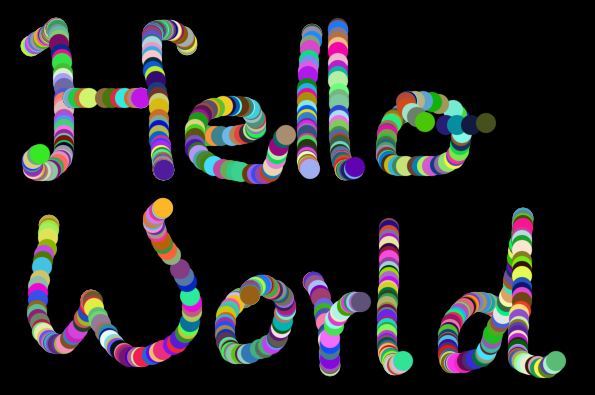
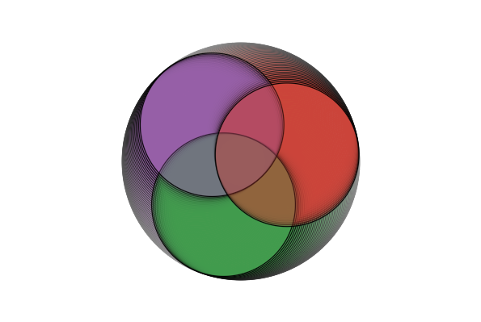

# Pictura.jl

A lightweight 2D graphics package, inspired by [Processing](https://processing.org/) and powered by a Zig+Vulkan backend. Ideal for creative coding, generative art and prototyping visual applications.


## Quick Start

```julia
@pictura begin
    setup(size(600, 400))
    nostroke()
    background(0)

    @drawloop begin
        if mouse().l
            fillcolor(rand(), rand(), rand())
            circle(mouse().x, mouse().y, 10)
        end
    end
end
```



## Features

Check out [test/demos.jl](test/demos.jl) for some short demos.

- Custom Zig+Vulkan core for performance and flexibility
- API inspired by Processing for a familiar `setup()` and `@drawloop` structure 
- `@pictura` catches errors and closes the window automatically
- Ability to access pixel data directly via `pixels()[r,c]`, `loadpixels()` and `updatepixels()`
- Load and store images with `load_image(path)` and `save_image(img, path)`
- Functions to draw basic geometric shapes as well as images
- Macros like `@mousepressed`, `@mousedragged`, `@keyreleased`, etc. for advanced interactive sketches
- Use your favourite Julia packages, e.g. [ProceduralNoise.jl](https://github.com/Zhurgut/ProceduralNoise.jl) for procedural noise functions


## Requirements
- Vulkan 1.3 compatible GPU
- Currently, support is limited to x86_64 on Windows and Linux


## Demo: Julia Logo

Here a more complex sketch. Press left-click on your mouse to make it spin faster, and right-click to switch between light-mode and dark-mode. 

```julia
@pictura begin
    setup(size(600, 400))
    framerate(50)

    background(255)
    strokecolor(0)
    strokewidth(1.2)

    bg_color = color(255, 255, 255, 0.02)
    alpha = 0.3
    ϕ = 0.0
    speed = 0.04
    darkmode = false

    @mousepressed begin
        if BUTTON == RIGHT
            if darkmode
                background(255)
                bg_color = color(255, 255, 255, 0.02)
                strokecolor(0)
                darkmode=false
            else
                background(0)
                bg_color = color(0, 0, 0, 0.02)
                strokecolor(255)
                darkmode=true
            end
        elseif BUTTON == LEFT
            speed += 1.0
        end
    end
    
    @drawloop begin
        background(bg_color)
        translate(width()/2, height()/2)
        rotate(ϕ)

        D = height() / 4
        H = D / sqrt(3)
        radius = height() / 4.5

        fillcolor(57, 151, 70, alpha)
        circle(0, -H, radius)

        fillcolor(146, 89, 163, alpha)
        circle(+0.5D, sqrt(3/4)*D-H, radius)

        fillcolor(202, 60, 50, alpha)
        circle(-0.5D, sqrt(3/4)*D-H, radius)

        speed = max(speed * 0.98, 0.04)
        ϕ += speed
    end
end 
```


## Planned Features
- Documentation 
- Text rendering
- Controller support
- More shapes to draw (arc, quad, triangle, polygon, bezier curve, ...)
- more functions to work with colors (or deeper integration of Colors.jl)
- ability to use custom .frag shaders as with loadShader() in Processing